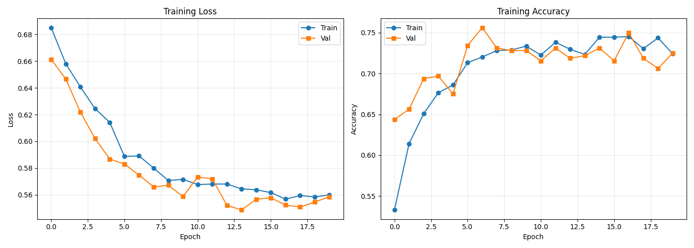
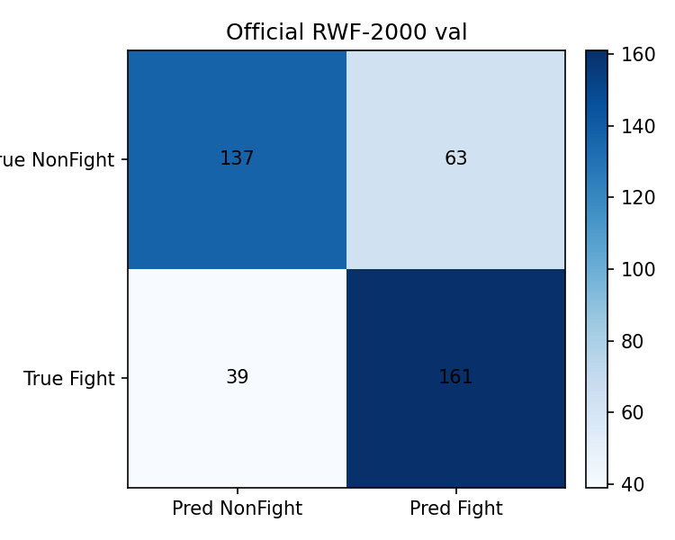
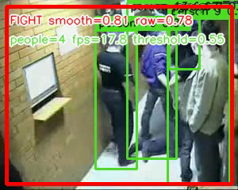

# Safe Camera Fight Detection

Video fight detection prototype built with a 3D ResNet-18 action-recognition model.

The project classifies short surveillance-style video clips as `Fight` or `NonFight`, then applies sliding-window temporal smoothing for longer videos.

## Features

- RWF-2000 dataset loader for `train/` and `val/` splits
- R3D-18 backbone pretrained on Kinetics-400
- Transfer learning with an optional frozen backbone
- Single-video annotated inference
- Long-video sliding-window processing with event CSV output
- YOLO person detection/tracking for webcam, RTSP, or video files
- CPU, CUDA, and Apple MPS device selection

## Project Structure

```text
docs/assets/                # Curated public result images and demo video
src/
├── dataset_rwf.py           # RWF-2000 video dataset
├── model.py                 # R3D-18 binary classifier
├── train_rwf.py             # Training loop
├── inference.py             # Annotated single-video inference
├── long_video_processor.py  # Sliding-window smoothing and event export
├── webcam_processor.py      # Live webcam/stream fight detection
├── person_detector.py       # YOLO person boxes and anonymous tracking IDs
└── safety_monitor.py        # Combined YOLO people + fight probability monitor
```

Large local assets are intentionally ignored: datasets, trained weights, generated videos, and experiment outputs.

## Current Results

The first baseline was trained on the RWF-2000 `train/` split with a frozen R3D-18 backbone and a newly trained binary classification head. Final evaluation was done on the official untouched RWF-2000 `val/` split.

| Metric | Value |
|---|---:|
| Official val videos | 400 |
| Accuracy | 74.5% |
| Fight precision | 71.9% |
| Fight recall | 80.5% |
| Fight F1 | 75.9% |
| Fight class accuracy | 80.5% |
| NonFight class accuracy | 68.5% |

Confusion matrix on the official validation split:

```text
                Pred NonFight   Pred Fight
True NonFight       137            63
True Fight           39           161
```

Training curves:



Official validation confusion matrix:



Combined true-positive demo snapshot:

This example shows the combined monitor: YOLO draws green temporary person tracking boxes while the fight model reports the smoothed fight probability. In this 150-frame demo, all 134 scored frames were labeled `FIGHT`, with average smoothed `p_fight=0.800` and max smoothed `p_fight=0.877`.



Combined annotated demo video:

[Download/watch the MP4 demo](docs/assets/true_positive_demo.mp4)

## Setup

```bash
python3 -m venv venv
source venv/bin/activate
pip install -r requirements.txt
```

Expected RWF-2000 layout:

```text
data/rwf2000/RWF-2000/
├── train/
│   ├── Fight/
│   └── NonFight/
└── val/
    ├── Fight/
    └── NonFight/
```

## Train

```bash
python src/train_rwf.py \
  --data-dir data/rwf2000/RWF-2000 \
  --model-dir models \
  --epochs 20 \
  --batch-size 8 \
  --num-frames 16
```

The default mode freezes the pretrained backbone and trains the final classification layer.

## Single Video Inference

```bash
python src/inference.py \
  data/rwf2000/RWF-2000/val/Fight/example.avi \
  --model models/fight_detector.pth \
  --output results/example_annotated.mp4 \
  --num-frames 16 \
  --stride 8 \
  --threshold 0.5 \
  --no-display
```

## Long Video Processing

```bash
python src/long_video_processor.py \
  input_video.mp4 \
  --model models/fight_detector.pth \
  --output results/input_video_annotated.mp4 \
  --num-frames 16 \
  --stride 8 \
  --threshold 0.55 \
  --smooth-window 5
```

This writes an annotated video and an `_events.csv` file with detected fight intervals.

## Webcam Fight Detection

```bash
python src/webcam_processor.py \
  --source 0 \
  --model models/fight_detector.pth \
  --output results/webcam_fight_demo.mp4 \
  --csv results/webcam_fight_demo.csv \
  --duration 10 \
  --num-frames 16 \
  --stride 8 \
  --smooth-window 3 \
  --threshold 0.55 \
  --device auto
```

Use `--no-display` when running without a preview window.

## YOLO Person Detection

The person detector uses an Ultralytics YOLO model pretrained on COCO. COCO includes a ready `person` class, so no person-specific training is needed for the first prototype. The default `yolo11n.pt` weight is downloaded automatically on first run.

Webcam:

```bash
python src/person_detector.py \
  --source 0 \
  --output results/webcam_people.mp4 \
  --csv results/webcam_people.csv \
  --duration 10 \
  --device auto \
  --track
```

Video file:

```bash
python src/person_detector.py \
  --source input_video.mp4 \
  --output results/input_people.mp4 \
  --csv results/input_people.csv \
  --device auto \
  --track \
  --no-display
```

`--track` gives temporary anonymous IDs such as `person 1` and `person 2`. It does not recognize a real person's identity.

## Combined Safety Monitor

This runs both parts together on the same stream: YOLO draws people, while the R3D-18 model estimates fight probability from a rolling 16-frame window.

```bash
python src/safety_monitor.py \
  --source 0 \
  --fight-model models/fight_detector.pth \
  --output results/safety_monitor.mp4 \
  --csv results/safety_monitor.csv \
  --duration 10 \
  --fight-device auto \
  --yolo-device auto \
  --track
```

For a video file:

```bash
python src/safety_monitor.py \
  --source input_video.mp4 \
  --fight-model models/fight_detector.pth \
  --output results/input_safety_monitor.mp4 \
  --csv results/input_safety_monitor.csv \
  --duration 0 \
  --track \
  --no-display
```

The combined CSV includes `fight_label`, raw and smoothed `p_fight`, `people_count`, temporary `person_id`, and bounding-box coordinates.

## Notes

This is a research/prototype pipeline, not a production safety system. Thresholds should be calibrated for the target camera domain and alert tolerance.
